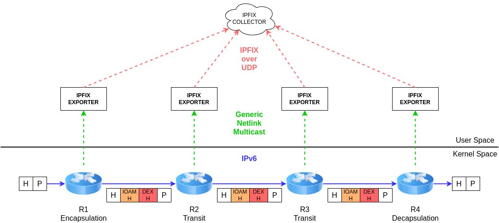

# DEX Architecture

The following diagram depicts how IOAM DEX works across user and kernel spaces.

## Kernel space

The implementation relies on **Linux lightweight tunnel** (LWT).

The **encapsulating** node (R1) is responsible for appending both the **IOAM and IOAM DEX headers**.
Once a packet contains the headers, a **generic netlink multicast event** is triggered. This event contains the fields from the header and the IOAM data of the encapsulating node.

The **transit** nodes (R2 and R3) receive the packet with both headers, but they cannot modify them.
Yet, they generate a **generic netlink mutlicast event** as the encapsulating node.

Finally, the **decapsulating** node (R4) generates a **generic netlink mutlicast event** and removes both IOAM and IOAM DEX headers to prevent the leakage of potentially sensitive data.

## User space

RFC 9326, which specifies IOAM DEX, does not specify the functionality of local processing, or exporting methods and format.
This justifies why we decided to trigger a generic netlink event in order to have a solution as modular as possible.

However, we provide a user space **IPFIX Exporter** which receives IOAM data from generic netlink multicast events and converts them to IPFIX format.
Subsequently, it can send the data towards an IPFIX collector and/or print it on the terminal.
