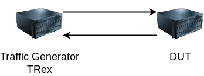

# Scripts

This folder contains scripts for the evaluation of the kernel space implementation of IOAM DEX.

## Testbed

Our testbed is made of 2 servers:
1) One server acting as a traffic generator using the software [TRex](https://trex-tgn.cisco.com/);
2) One acting as the Design Under Test (DUT).

|        | Traffic Generator    | DUT                  |
|--------|----------------------|----------------------|
| CPU    | Intel Xeon E5-2630v3 | Intel Xeon E5-2630v3 |
| RAM    | 32GB DDR4            | 16GB DDR4            |
| NIC    | Intel XL710          | Intel XL710          |
| Kernel | Linux 5.17           | Patched Linux 6.12   |

## Scripts

- [`generator`](./generator/) directory contains the scripts to put on the generator;
- [`dut`](./dut/) directory contains the scripts to put on the DUT.
